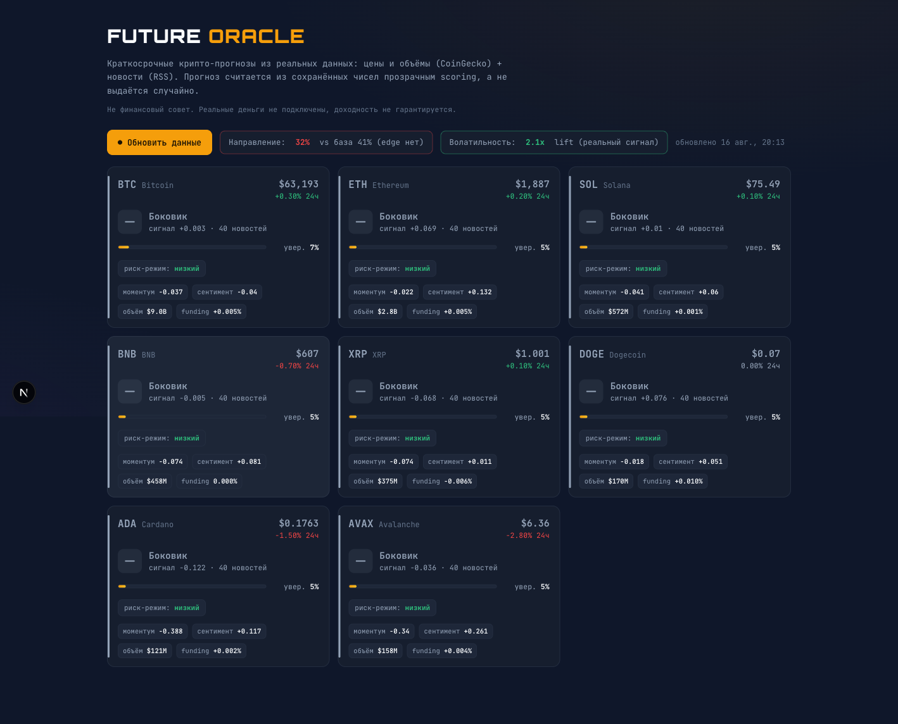
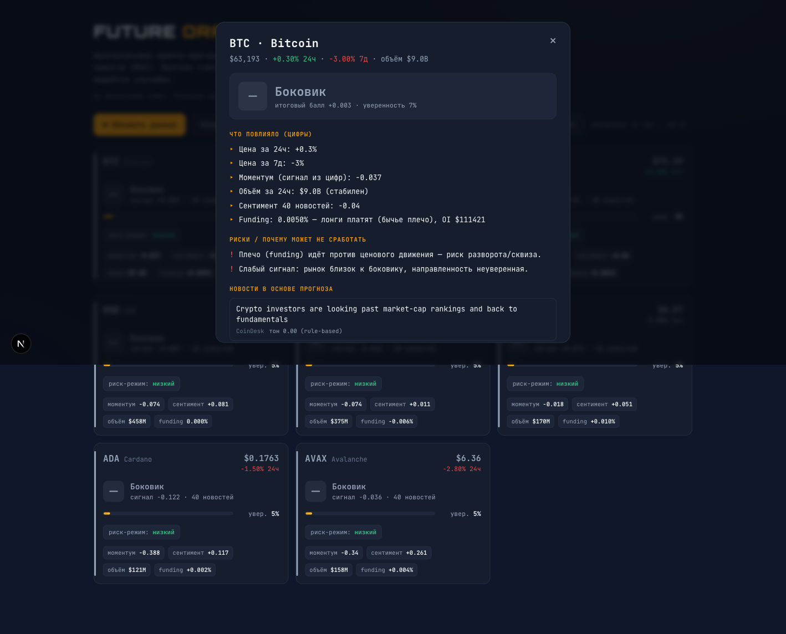

# Future Oracle — крипто-прогнозер

Краткосрочные прогнозы направления цены по топ-крипте, посчитанные из **реальных данных**:
цены (CoinGecko) + новости (RSS). Прогноз не случайный — он детерминированно считается из
сохранённых чисел прозрачным scoring, с уверенностью, риском и сверкой постфактум.

> Не финансовый совет. Реальные деньги не подключены, доходность не гарантируется.

**Живая версия:** https://future-oracle-live.vercel.app



Карточка прогноза с разбором (что повлияло / риски / новости в основе):



## Как запустить

```bash
npm i
npm run dev        # http://localhost:3000
```

Работает **из коробки без ключей**: сентимент новостей считается rule-based лексиконом.
Для более точного сентимента добавь LLM-ключ (по умолчанию Groq, бесплатно на console.groq.com):

```bash
cp .env.example .env      # впиши LLM_API_KEY
npm run ingest            # разовый живой сбор данных в терминале
npm run eval              # юнит-тесты ядра прогноза
```

## Область прогноза

Выбрана **криптовалюта, краткосрочное направление цены** (BTC, ETH, SOL, BNB, XRP, DOGE, ADA, AVAX).
Причина выбора: под требование «цифры должны сходиться» нужны два независимых **бесплатных и
реальных** источника без регистрации — цены и новости — и понятная область, где сигнал считается
из чисел, а не из вкуса.

## Источники данных (два, реальные)

| Источник | Что даёт | Как получаем |
|---|---|---|
| **CoinGecko** (free API) | цена, объём, изменение за 24ч и 7д | `lib/coingecko.js`, без ключа |
| **Google News RSS** (поиск по каждому коину) | ~40-60 свежих новостей на актив → сентимент | `lib/feeds.js` + `lib/ingest.js` |
| **Binance Futures** (funding + open interest) | позиционирование плечей → сигнал | `lib/binance.js` |

## Как устроено хранение

SQLite (`better-sqlite3`), схема в `lib/db.js`:

- `assets` — объекты прогноза;
- `price_snapshots` — сырые снимки цен (**история обновлений**, не перезатираются);
- `news_items` — сырые новости;
- `news_sentiment` — нормализованный показатель: тон новости по активу `[-1..+1]`;
- `predictions` — прогнозы + поля сверки постфактум (`resolved_price`, `actual_dir`, `hit`).

На serverless (Vercel) база живёт в `/tmp` (эфемерная), поэтому при пустой базе данные
досеиваются автоматически: сначала живой сбор, при сбое сети — офлайн-снапшот `data/seed.json`.

## Как работает алгоритм (прозрачный scoring)

Всё в `lib/predict.js`, чистые функции, покрыты тестами. Прогноз = взвешенная сумма двух сигналов:

1. **Моментум** (сигнал из цифр): `0.6·norm(Δ24ч) + 0.4·norm(Δ7д)`, нормировка: 6% за 24ч или
   18% за 7д = насыщение. 24ч весит больше (краткосрочный прогноз).
2. **Сентимент** (сигнал из новостей): тон заголовков по активу `[-1..+1]`, **взвешенный по
   свежести** (свежая новость важнее). Тон ставит LLM (фолбэк — лексикон). Сюжеты дедуплицируются,
   чтобы 5 перепечаток одной новости не считались за 5.
3. **Funding** (сигнал позиционирования): funding rate Binance Futures, нормирован `[-1..+1]`.
   Положительный = лонги переполнены (бычье плечо), отрицательный = шорты.

```
score = взвешенное среднее по присутствующим сигналам (веса 0.45 / 0.35 / 0.20)
направление = up / down / flat   по порогу ±0.12
```

**Уверенность** (0..100, не «да/нет»): сила итогового балла, скорректированная на:
- **согласие источников** (моментум и сентимент в одну сторону) → выше;
- **спор источников** → ниже;
- **подтверждение объёмом** — направленное движение на растущем объёме надёжнее, чем на
  падающем (классическое volume-confirmation); тренд объёма считается из двух снимков (история);
- покрытие новостями и волатильность.
Честный потолок 92% — 100% не выдаём никогда.

**Риск / почему может не сработать:** высокая волатильность, спор цифр и новостей, тонкое
новостное покрытие, слабый сигнал (близко к боковику). Показывается в карточке.

## Какие цифры должны сходиться

- `score` карточки в точности пересчитывается из `momentum` и `sentiment` (проверяется в `npm run eval`).
- `momentum` пересчитывается из сохранённых `chg_24h` / `chg_7d` снимка.
- Прогноз **детерминирован**: один и тот же вход → один и тот же выход (тест на воспроизводимость).
- Ни одно число в карточке не появляется случайно — всё выводимо из таблиц `price_snapshots` и `news_sentiment`.

## Как система понимает, что ошиблась (и что честно работает, а что нет)

Полноценный **walk-forward бэктест** (`lib/backtest.js`, `npm run backtest`) на **365 днях**
истории, out-of-sample (порог калибруется на train, метрики считаются на test). Меряет **две
задачи** и сравнивает с наивными бейзлайнами — 1152 тестовых дня:

**A) Направление (up/down/flat) — edge НЕТ, и я это не прячу.**
Точность ~32% против ~41% у бейзлайна «всегда самый частый класс», edge отрицательный.
Краткосрочное направление крипты близко к случайному. Поэтому модель **по умолчанию молчит**
(«боковик»), порог поднят по калибровке, и направление зовётся только на сильном сигнале.
Наращивать фичи под направление смысла нет — бэктест показал, что это подгонка под шум.

**B) Волатильность (будет ли крупное движение >3%) — тут РЕАЛЬНЫЙ edge.**
Крупные движения кластеризуются. В дни высокой недавней волатильности крупное движение
случается в **~41% против ~19% базовых** (и ~17% в спокойные дни) — **lift 2.1x**. Это
измеримый сигнал, поэтому продукт честно показывает **риск-режим** (низкий/средний/высокий)
на каждой карточке, а не обещает угадать up/down.

Плюс live-сверка: каждый прогноз хранит `base_price` и сверяется с фактической ценой на
следующем обновлении. Доходность не обещается — и ТЗ этого требует.

## Что использовано из AI

- **Сентимент новостей** — LLM (Groq, `llama-3.3-70b-versatile`) оценивает тон заголовка числом
  `[-1..+1]`. Провайдер вынесен в env, есть rule-based фолбэк — без ключа приложение работает.
- Scoring, уверенность, риск и сверка — **не** LLM, а детерминированный код: это область, где
  «цифры должны сходиться», и полагаться на модель здесь нельзя.

## Журнал разработки (как думали)

Не «что вышло», а почему выбраны именно эти решения.

1. **Почему крипта.** Требование «цифры должны сходиться» отсекает области без чётких
   чисел. Нужны два независимых **бесплатных** реальных источника без регистрации — цены
   и новости. Крипта даёт и то, и другое (CoinGecko + RSS), и область, где сигнал реально
   считается из чисел.
2. **Почему scoring кодом, а не «спроси LLM, куда пойдёт цена».** Прогноз цены моделью —
   это чёрный ящик, который нельзя объяснить и проверить. ТЗ требует прозрачности и «цифры
   должны сходиться», поэтому направление считает детерминированный код, а LLM отвечает
   только за узкое: тон новости. Балл карточки пересчитывается из сохранённых чисел (тест).
3. **Почему уверенность = сила сигналов + их согласие.** «Да/нет» запрещено. Один сигнал
   (только цена или только новости) слабее двух согласных. Когда цифры и новости спорят —
   это честно отражается снижением уверенности и отдельным риском, а не прячется.
4. **Ловушка коротких тикеров (поймана на QA).** Первая версия привязки новостей к активам
   ловила тикер как подстроку — и заголовок «GPT-5.6 **Sol** Ultrafast» прилетал в прогноз
   Solana, а «**Ada** Lovelace» — в Cardano. Это ровно тот случай, когда «AI-магия» тихо
   портит данные. Разделил: полные имена матчатся без регистра как цельные слова, а короткие
   тикеры — только заглавным standalone-токеном (`SOL`, `$BTC`), не `Sol`. Закрыто тестами.
5. **Serverless без внешней БД.** Vercel даёт writable только `/tmp`, между инстансами база
   расходится. Решение: эфемерная SQLite + авто-досев (живой сбор, при сбое сети — офлайн
   `seed.json`). Демо поднимается даже если CoinGecko временно недоступен.
6. **Сверка постфактум, а не «выдал и забыл».** Прогноз без обратной связи бесполезен.
   Каждый хранит цену на момент прогноза и сверяется с фактической на следующем обновлении —
   так копится честная метрика точности.
7. **Объём — не мёртвые данные.** Первая версия тянула объём с CoinGecko и хранила его, но
   нигде не использовала. По ТЗ должно быть «понятно, какие объёмы повлияли». Ввёл
   volume-confirmation: тренд объёма из двух снимков влияет на уверенность (растущий объём
   подтверждает движение, падающий — риск) и виден в карточке. Заодно задействует «историю
   обновлений».
8. **Дизайн по системе, а не на глаз.** Вёрстку прогнал через дизайн-движок (ui-ux-pro-max):
   стиль data-dense dashboard, палитра «золото+тех», типографика Orbitron (вордмарк) +
   JetBrains Mono (табличные цифры), SVG-иконки вместо текстовых стрелок, focus-состояния и
   `prefers-reduced-motion` для доступности.
9. **Новости: по коину, а не общей лентой.** Первая версия брала 2 общих RSS и привязывала
   новости по ключевым словам — мелкие коины оставались пустыми, всё утекало в биток. Перешёл
   на Google News RSS-поиск по каждому активу: ~40-60 свежих осмысленных новостей на коин, привязка
   по запросу (без ложных подстрок). Сентимент — LLM батчами по 12 с пулом на 3 актива
   (иначе 8 одновременных запросов ловят rate-limit и падают в rule-based); при сбое батча —
   rule-based, приложение не ломается. Плюс дедуп сюжетов и вес по свежести.
10. **Честный бэктест вместо надутой точности.** Старая метрика («точность 50-75%») была
    иллюзией: сверяла два снимка с разницей в минуты, где почти всё — «боковик». Заменил на
    настоящий walk-forward бэктест на 40 днях истории со сравнением с наивным бейзлайном. Он
    показал неудобное: ценовой сигнал бейзлайн не бьёт. Оставил как есть — честный отрицательный
    результат сильнее фальшивого позитивного.
11. **Сигнал с реальным edge — деривативы.** Цена+новости для направления слабы, поэтому добавил
    funding rate и open interest с Binance Futures (без ключа): позиционирование плечей как
    третий сигнал, подтверждение/спор с ценой в уверенности и рисках.
12. **Устойчивость к лимитам API.** CoinGecko free строгий: markets + история для бэктеста легко
    ловят 429. Добавил ретрай с бэкоффом, кэш дневной истории на диск (`history-cache.json`),
    бэктест на холодном старте не гоняю (беру из seed), предохранитель против записи пустого seed.
13. **Измерил вместо того, чтобы гадать.** Вместо накрутки точности построил честный harness на
    365 днях (`npm run backtest`): две задачи, бейзлайны, out-of-sample, ablation. Он показал
    неудобное — направление edge не даёт (~32% vs 41%), — и подсказал, где edge реально есть:
    волатильность (lift 2.1x). Это и есть главная правка: не тюнить шум под направление, а
    вынести то, что работает. Отрицательный результат оставлен как есть.

## Что сдаётся

- Код: этот репозиторий.
- Скриншоты интерфейса: `screenshots/`.
- README: запуск, область, источники, хранение, алгоритм, что сходится, что из AI.
